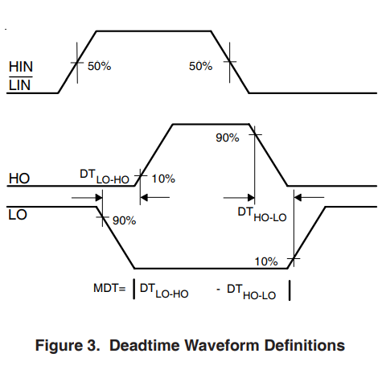
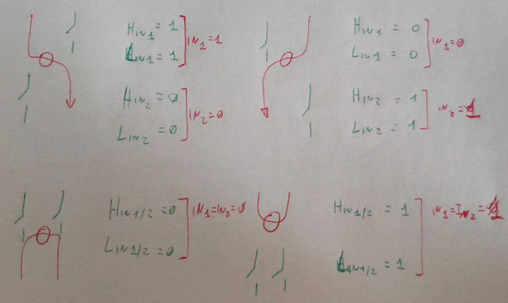
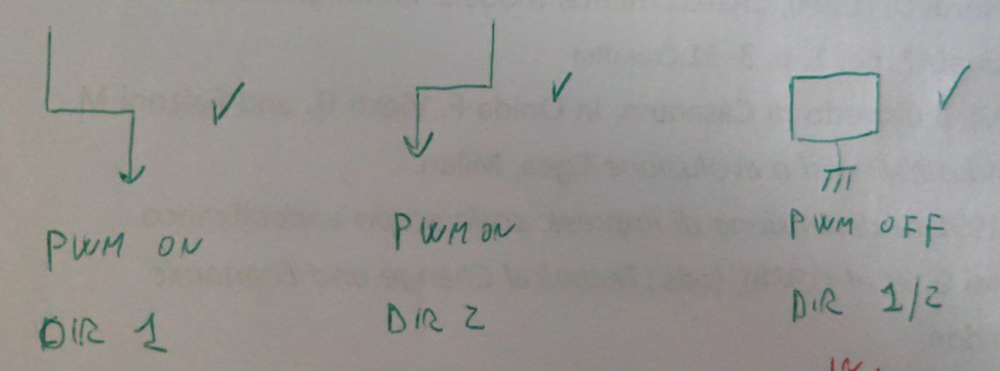

# Eletronic Note

## Motor Drive Note

I driver mosfet non possiedono una logica H-Bridge (essendo dei driver HALF-Bridge)

La loro tabella logica è:

|  Signal  |     Conf 1     |     Conf 2      | Conf 3 | Conf 4 |
| :------: | :------------: | :-------------: | :----: | :----: |
| **Hin**  |       1        |        0        |   1    |   0    |
| **~Lin** |       1        |        0        |   0    |   1    |
|  **Ho**  |       1        |        0        |   0    |   0    |
|  **Lo**  |       0        |        1        |   0    |   0    |
|          | *Conduce alto* | *Conduce Basso* | Aperto | Aperto |

A questi risultati c'è da aggiungere che il chip aggiunge un ritardo controllato quando deve transitare da `Low --> High` per garantire l'assenza di contro correnti.

## Creazione H-brige

Dovendo creare un H-bridte, e tenuto conto della tabella di verità di ogni Half-Bridge viene fuori che è possibile cortocircuitare i 2 ingressi di ogni driver per ottenere le configurazioni di interesse:

Da qui è possibile risalire alla tabella di verità di nostro interesse:

| IN1  | IN2  |       Effect       |
| :--: | :--: | :----------------: |
|  0   |  0   | Corto Tramite GND  |
|  0   |  1   |       Flow +       |
|  1   |  0   |       Flow -       |
|  1   |  1   | Corto Tramite VMot |

Per i nostri scopi di linearizzazione le Configurazioni di interesse sono:

Da qui è possibile creare una funzione : `F(PWM,Dir) --> (IN1,IN2)` la cui tabella di verità è:

| PWM  | Dir  | IN1  | IN2  |
| :--: | :--: | :--: | ---- |
|  1   |  0   |  1   | 0    |
|  1   |  1   |  0   | 1    |
|  0   |  0   |  0   | 0    |
|  0   |  0   |  0   | 0    |

Da cui:

- `IN1= Pwm * ~Dir`
- `IN2= Pwm * Dir`

Funzioni creabili o in Logica HW, o tramite una funzione nel Micro-Controllore

## A1 && V2 Read

Per leggere i 2 parametri di interesse della scheda (A1 e V2) vengono campionati i segnali analogici generati, per la corrente attraverso un sensore di corrente a effetto HALL, che trasforma la corrente in tensione, per la Tensione sul secondario si era provato inizialmente usando un INA126, che per motivi sconosciuti, ha un ouptut sbagliato [Problemi V2](V2 problem/problemV2.md), si è optato quindi per una misura diretta della tensione sul secondario.

