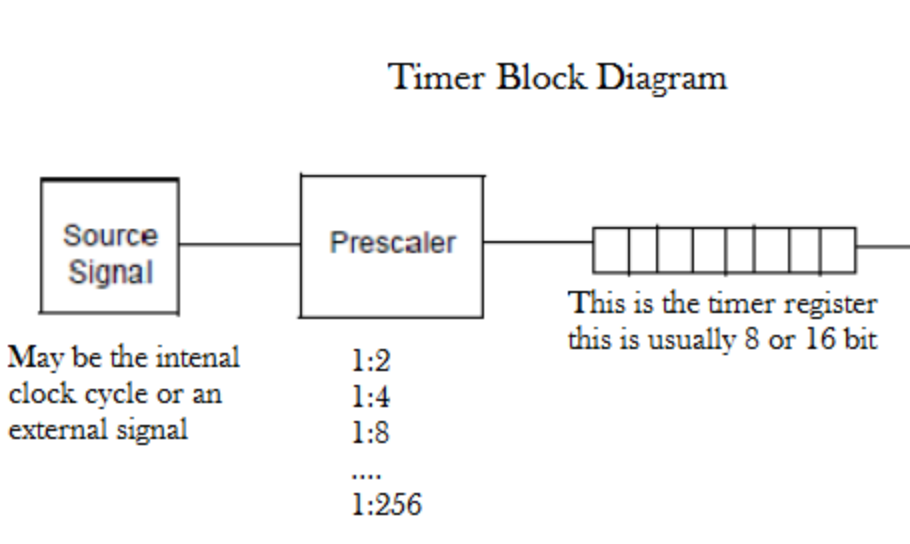
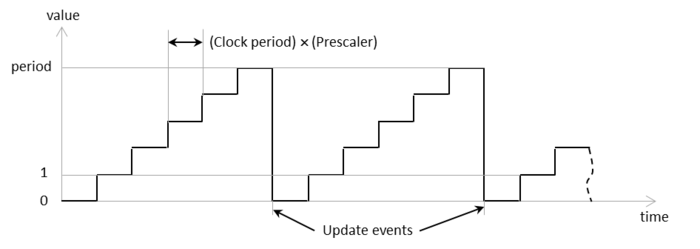
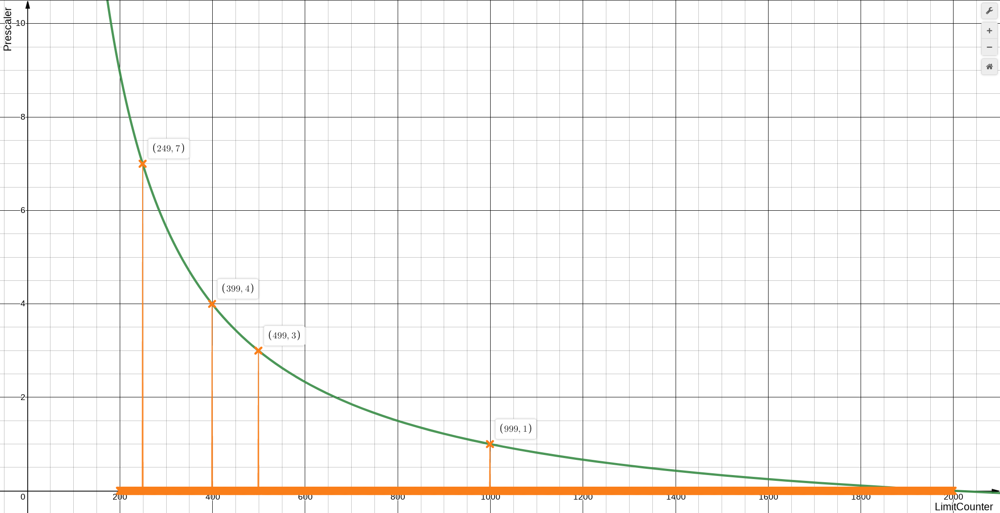
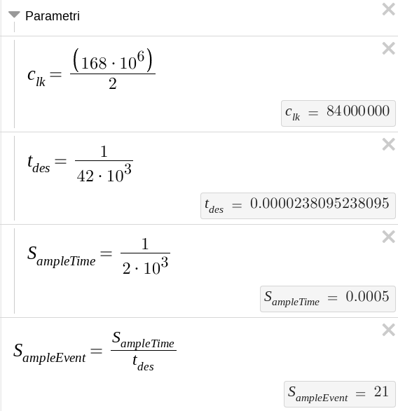
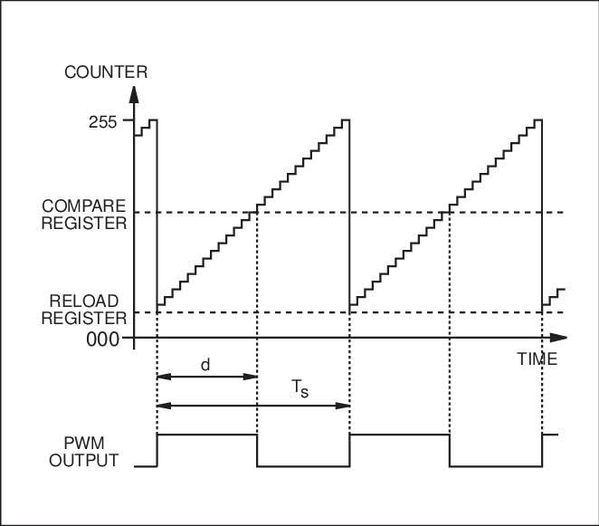

# Note di sviluppo nella STM32 

### Timer 3

Per poter eseguire il PWM attraverso gli interrupt, è stato necessario programmare opportunamente l'HAL affinchè i giusti segnali fossero attivati. (Vedi codice)

Il timer 3 in questione 

Una volta impostato correttamente il sistema, è nata la necessità di impostare correttametne i registri del timer:



La sorgente della scheda è a 168Mhz, ma il contatore del timer, ha come frequenza minima la metà (84MHz). 

Possiamo vedere di seguito il diagramma dell'evoluzione temporale di questo registro:

 

Esso conta un `Value` alla volta fino a ragiungere il `period` dove il timer in automatico si resetta e ricomincia a contare.

Unendo i dati a nostra disposizione (86Mhz frequenza base, Periodo desiderato ~40Khz) bisogna risolvere la seguente funzione:
$$
UpdateEvent = \frac{1}{Clock[Hz]} \cdot (Prescaler + 1) \cdot (Period + 1)
$$
da cui deriva:
$$
Prescaler(Period) = \frac{UpdateEvent \cdot Clock[Hz]}{Period + 1} - 1
$$
E per le quali siamo interessati alle soluzioni intere per il `Prescaler ` e il `Period`



E usando questi parametri:



Risulta quindi che, impostando i registri a:

- `Prescaler` = 1
- `Period`= 999

Le seguenti specifiche:

-  un Evento di Sample, attendendo esattamente 21 Overflow del timer
- PWM con Frequenza a 42Khz, una finezza di controllo dello 0,1%.

### PWM Generation

Poichè in questa situazione, il controllo del motore passa per 4 pin che devono essere mossi contemporaneamente e nella giusta configurazione ([Vedi note  elettriche](/02_Eletronics/ElettronicNote.md) ), è stato necessario catturare 2 diversi segnali di interrupt:



Dove il `PWM High()` corrisponde anche all'interrupt di fine periodo, e il `PWM_LOW()` all'interrupt di Compare del canale 1 del timer 3.

Per evitare spiacevoli sfarfallamenti, nel codice sono stati previsti 2 IF dentro gli interrupt, che evitano di chiamare la funzione corrispondente se il `CompareRegister` ha lo stesso valore che fa scattare l'interrupt

### Code Interrupt Look

Ecco il codice catturato all'interno dei 2 Interrupt che permetti di vedere come si svolgono le cose:

```c++
void HAL_TIM_PeriodElapsedCallback(TIM_HandleTypeDef *htim) {

	if (htim->Instance == TIM3) {
		periodCount = (periodCount + 1) % SampleEventperiodCount;
		if (__HAL_TIM_GET_COMPARE(&htim3, TIM_CHANNEL_1) != 0)
			//	Reload the High level at the end of the period, ready for new count
			HIGH_PWM();
		if (periodCount == 0)
			sampleEvent();
	}

}

void HAL_TIM_PWM_PulseFinishedCallback(TIM_HandleTypeDef *htim) {
//	On the pulse compare, change the state to LOW and wait the end of the period
	if (htim->Instance == TIM3) {
		if (htim->Channel == HAL_TIM_ACTIVE_CHANNEL_1) {
			if (__HAL_TIM_GET_COMPARE(&htim3, TIM_CHANNEL_1) != TIM3->ARR)
				LOW_PWM();
		}
	}
}
```

---

[HOME](/README.md)

